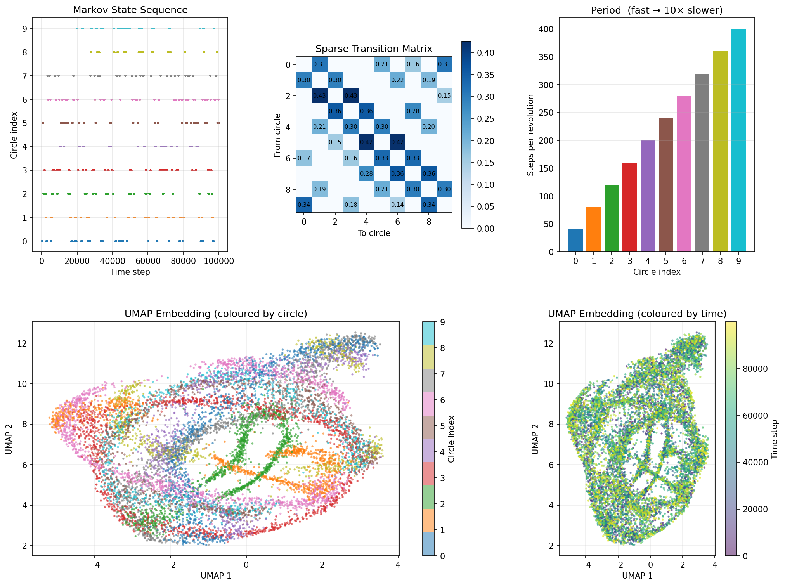
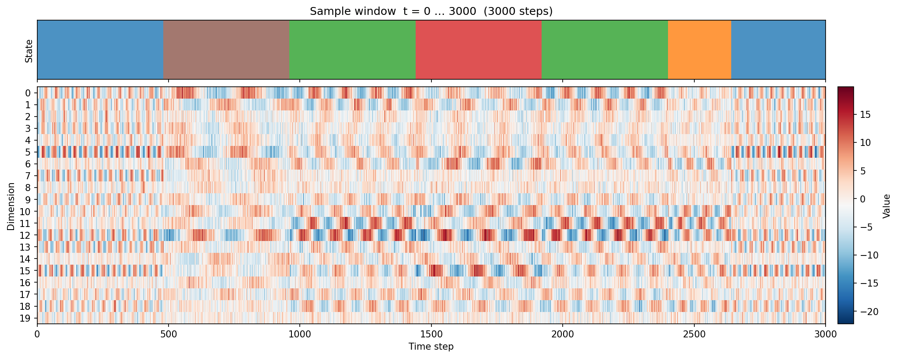
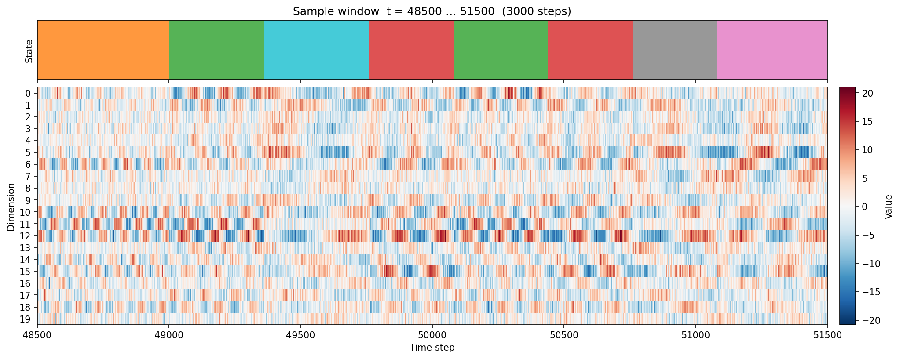
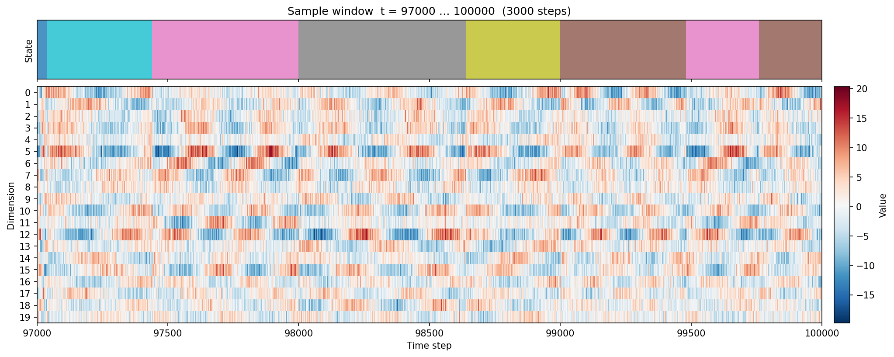
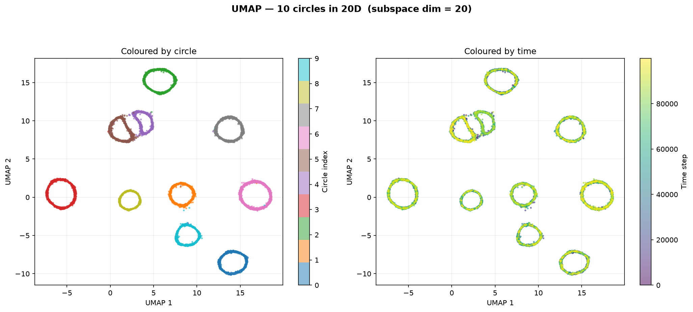
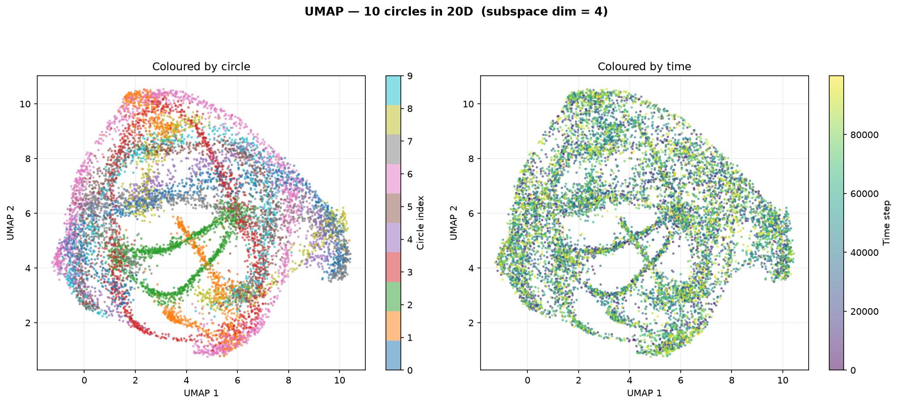

# Synthetic Song

Synthetic syllable-based time series on circles in high-dimensional space, with Markov switching dynamics.

> **Screening task:** if you were sent here for the AI engineer screen, the task description is in [TASK.md](TASK.md).

## Overview

This project generates a time series that mimics syllable-structured sequential data (like birdsong). A point traverses one of 10 circles embedded in 20-dimensional space, switching between circles according to a sparse Markov transition matrix. Each circle has a fixed angular velocity, producing distinct oscillation frequencies that serve as a signature for each "syllable."

### Key properties

- **10 circles** in 20D ambient space, each in its own random 2D sub-plane, all sharing the same center (origin)
- **Statistically similar radii** (~20), large enough that the circular signal spans all dimensions
- **Fixed angular velocity per circle**, with periods ranging from 40 steps (fastest) to 400 steps (slowest) — a 10x speed range
- **~400 step dwell time** per visit, achieved by varying the number of complete revolutions (quantised to whole laps so entry/exit angles are fixed)
- **Sparse off-diagonal transition matrix** with ring connectivity plus long-range shortcuts
- **Controllable geometric overlap** via the `--subspace-dim` flag (see below)

## Scripts

### `markov_circles_timeseries.py`

Generates the Markov-switching circle time series with optional UMAP visualisation.

```bash
python markov_circles_timeseries.py                    # full run with UMAP
python markov_circles_timeseries.py --no-umap          # skip UMAP (much faster)
python markov_circles_timeseries.py --subspace-dim 4   # with geometric overlap
```

#### Subspace dimensionality (`--subspace-dim`)

By default each circle's 2D plane is drawn independently from the full 20D ambient space. In high dimensions, random planes are nearly orthogonal, so the 10 circles occupy essentially non-overlapping subspaces and their noisy trajectories never cross.

The `--subspace-dim` flag forces all circle planes into a shared subspace of the given dimension. Because there are only `subspace_dim` directions available, the 2D planes must share basis directions and the circles overlap geometrically. Combined with observation noise, this produces actual trajectory crossings in the ambient space.

| `--subspace-dim` | Behaviour |
|---|---|
| **20** (or omitted) | Each circle's plane is drawn from the full 20D space. Planes are nearly orthogonal — **minimal overlap**. This is the default. |
| **4–6** | All 10 circle planes are drawn from a 4–6D subspace. Planes share many directions — **significant overlap**. UMAP shows partially merged clusters with trajectories crossing between circles. |
| **3** | 10 circles in 3D. Most plane pairs intersect along a line — **heavy overlap**. |
| **2** | All circles are **coplanar** (same 2D plane). They become concentric rings separated only by their slightly different radii and noise. **Maximum overlap**. |

This parameter is recorded in `data/config.json` for reproducibility. It sets the true dimension of the subspace the circles collectively span: with `--subspace-dim 4`, for example, the entire trajectory lives in a 4-dimensional subspace of the 20-dimensional ambient space.

### `dataset.py`

PyTorch `Dataset` for the synthetic-song time series. Loads `data/data.npz` and serves fixed-length sliding windows with patch-based masking, ready for a BERT-style masked prediction model.

```python
from dataset import SyntheticSongDataset

ds = SyntheticSongDataset('data', seq_len=512)
x, state, mask = ds[0]
```

## The data

### Markov-switching time series summary



**Top row:** Markov state sequence over time, sparse transition matrix, and per-circle period (steps per revolution).
**Bottom row:** UMAP embedding coloured by circle index and by time step.

Note: this composite figure is regenerated each run and reflects whichever `--subspace-dim` was last used. See the [UMAP comparison section](#umap-embeddings-at-different-subspace-dimensions) for side-by-side images at specific subspace dimensions.

### Sample data windows

Raw 20-dimensional time series with state labels. Each column is one time step; each row is one ambient dimension. The coloured strip at top shows which circle is active. Within each syllable, every ambient dimension oscillates sinusoidally at that circle's frequency; the mixture of amplitudes across rows reflects how the circle's 2D plane projects onto the ambient axes.







### UMAP embeddings at different subspace dimensions

The standalone UMAP plots below show how the `--subspace-dim` parameter affects the geometric structure of the data.

#### subspace_dim = 20 (no overlap — default)



With the full 20D ambient space available, each circle's 2D plane is nearly orthogonal to every other. UMAP cleanly separates all 10 circles into distinct, well-isolated loops.

#### subspace_dim = 4 (significant overlap)



When all 10 circle planes are drawn from a shared 4D subspace, planes must share basis directions and the circles overlap geometrically in the ambient space. UMAP can no longer fully separate them — clusters merge and trajectories from different circles intermingle.

## Requirements

```
numpy
matplotlib
umap-learn
torch        # optional, only needed for dataset.py
```

Install into a virtual environment:

```bash
python -m venv venv
source venv/bin/activate
pip install numpy matplotlib umap-learn
pip install torch  # optional, for the PyTorch data loader
```
